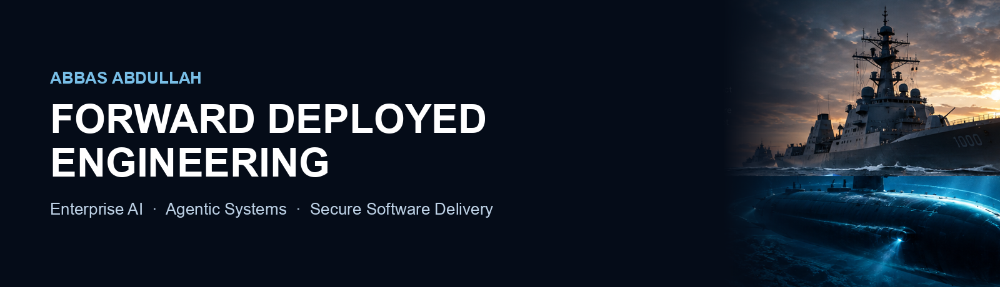

I turn business problems into secure, measurable AI and software systems, from discovery and architecture through implementation, testing and handoff. Based in Dallas, TX.

[Website](https://www.elliyeen.com) · [LinkedIn](https://www.linkedin.com/in/abbasabdullah)

---

## Featured engineering

| | [CAC/PIV Authentication](https://github.com/elliyeen/cac-piv-pki-authentication) | [Ahead / Aliya](https://aheadjobs.com) |
| :--- | :--- | :--- |
| **Problem** | Adding smart-card (CAC/PIV) sign-in to an existing web application without trusting unverified identity headers. | Matching companies and talent on evidence of what needs to get done, with candidate consent before any introduction. |
| **Approach** | Trust boundary at the load balancer, header provenance checks, certificate chain and CRL validation, session controls. Documented in ADRs and a threat model. | Agentic matching with deterministic filtering before AI, human approval gates, and an audit trail. Documented in ADRs. |
| **Status** | Public reference implementation. Synthetic identities and certificates only. Not a production deployment. | Live product. Source is private. |
| **Evidence** | [Tests](https://github.com/elliyeen/cac-piv-pki-authentication/tree/master/reference-impl/src), [ADRs](https://github.com/elliyeen/cac-piv-pki-authentication/tree/master/adr), [5-minute walkthrough](https://github.com/elliyeen/cac-piv-pki-authentication/blob/master/docs/WALKTHROUGH.md). Run it yourself: `pnpm install && pnpm demo` in `reference-impl/` | [aheadjobs.com](https://aheadjobs.com) |
| **Stack** | TypeScript, Next.js, PKI/X.509 | TypeScript, Cloudflare Workers |

Known limitations are listed in each project, not hidden. For example, revocation checking in the CAC/PIV reference covers CRLs only.

---

## How I work

**Observe** the problem → **Define** users, constraints and acceptance criteria → **Design** and weigh alternatives → **Build** → **Verify** with tests and security review → **Operate** with monitoring and ownership → **Improve** in measured steps.

## Technical disciplines

| Domain | Core stack |
| :--- | :--- |
| **Systems and backends** | Rust (`tokio`, `axum`), TypeScript, Node.js, Python |
| **Agentic and protocols** | Model Context Protocol (MCP), Claude Code, human-in-the-loop workflows |
| **Infrastructure** | Cloudflare Workers, Pages, D1, GitHub Actions |
| **Security** | OWASP, IAM, secure SDLC |

## Other public work

[qaf](https://github.com/elliyeen/qaf) (Rust, SQLite, MCP server) · [kai-dart](https://github.com/elliyeen/kai-dart) · [Savannah PCS](https://elliyeen.github.io/savannah-pcs/) · [Associated Training Services](https://elliyeen.github.io/associatedtrainingservices/)

## Connect

[LinkedIn](https://www.linkedin.com/in/abbasabdullah)
